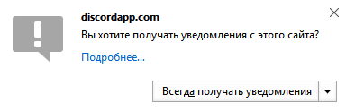

# Обязательно клиент качать? Хочу в браузере сидеть

На самом деле, клиент качать не обязательно. Веб-версия умеет практически все: и текстовые чаты, и голосовые.

Но только десктопный клиент умеет:

* Показывать рядом с вашим ником игру, в которую вы сейчас играете.
* Показывать в игре оверлей.
* Использовать push-to-talk голосовую связь (браузерная версия умеет только в активацию в голосу).
* Больше голосовых настроек.

Если вам это не нужно, то можете спокойно оставаться на веб-версии. Только не забудьте ее настроить.

## Настройки браузерной версии

Нажмите на шестеренку (слева снизу) и приступим к основным настройкам.

### Включить уведомления рабочего стола

В настройках перейдите на вкладку "Уведомления" и поставьте флажок "Включить уведомления на рабочем столе". Браузер спросит у вас разрешения на уведомления - согласитесь. Теперь когда вам кто-нибудь напишет, то появится уведомление, даже если открыта другая вкладка.

### Включить доступ к микрофону

Микрофон работает только в свежих версиях Firefox, Google Chrome (и аналогичных), Opera. В настройках дискорда перейдите на вкладку "Голос" 

* Остальные настройки

