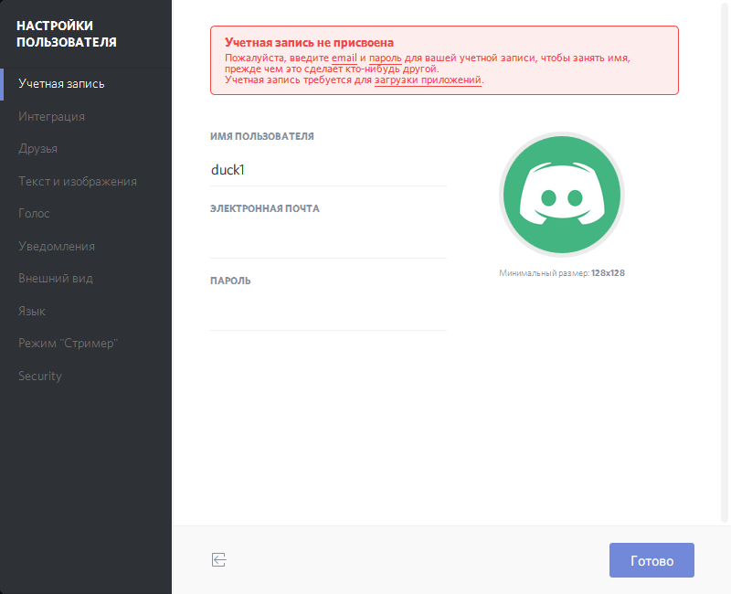

# Регистрация ника

Для регистрации нажмите "Присвоить учетную запись" (сверху) или нажмите на шестеренку (снизу справа). Откроется окно с настройкой учетной записи.

Укажите имя (ваш утиный ник), почту, пароль (не обязательно как на гудилапе, используйте любой), картинку (при желании) и нажмите "Готово". Вам на почту придет письмо с подтверждением почты — нажмите на ссылку в том письме. Регистрация закончена.

Следующий шаг: <a href="https://discordapp.com/download"  target="_blank">скачать</a> клиент и настроить его.