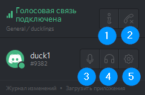
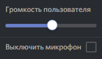

# Как использовать голосовую связь?

Чтобы включить голосовую связь, кликните по названию любого голосового канала.

Снизу слева появится надпись: «Голосовая связь подключена». Разберем по пунктам иконки:

1. Информация о соединении: пинг и т. п.
2. Отключиться (выйти из всех голосовых каналов).
3. Включить/выключить микрофон (перечеркнутый микрофон — значит выключен).
4. Включить/выключить заглушение (когда на иконке перечеркнутые наушники, то вы не будете слышать, что говорят другие пользователи).
5. Настройка дискорда.

Убедитесь, что микрофон включен (иконка не перечеркнута) и можете говорить. По-умолчанию включена активация по голосу (как в скайпе). Если вам нужен push-to-talk, то он включается в [настройке голоса](settings.md#голос). Там же настраивается чувствительность, громкость, приглушение приложений и др. А в [горячих клавишах](settings.md#горячие-клавиши) можно указать по какой кнопке выключать микрофон (или настроить push-to-mute, например).

Если сидите через браузер, то [включите в нем микрофон](browser.md#включить-доступ-к-микрофону).

## Каналы

Снизу под каждым голосовым каналом — список участников канала.

* Зачеркнутый микрофон: у участника выключен микрофон.
* Зачеркнутые наушники: участник не слышит, что говорят другие.
* Когда участник говорит, то вокруг его юзерпика отображается зеленая рамка.
* Список участников канала можно свернуть (иконка «вниз» слева от названия канала).
* В канал AFK автоматически перемещаются бездействующие участники голосовой связи. На утином сервере период бездействия — 15 минут.

## Персональная настройка

В дискорде нет необходимости просить кого-нибудь увеличить или убавить громкость микрофона. Вы можете сделать это сами. Причем громкость конкретного участника изменится только у вас.

Если кликнуть по участнику правой кнопкой (это работает в списке под названием канала и в списке справа), то в появившемся меню можно указать громкость участника (вы будете его слышать тише или громче) или вовсе выключить ему микрофон (конечно, остальные участники продолжат его слышать).

## Оверлей

Работа с оверлеем рассматривается в [отдельной статье](overlay.md). Там все примерно так же, но для изменения громкости участника кликайте по нему левой кнопкой мыши (а не правой).